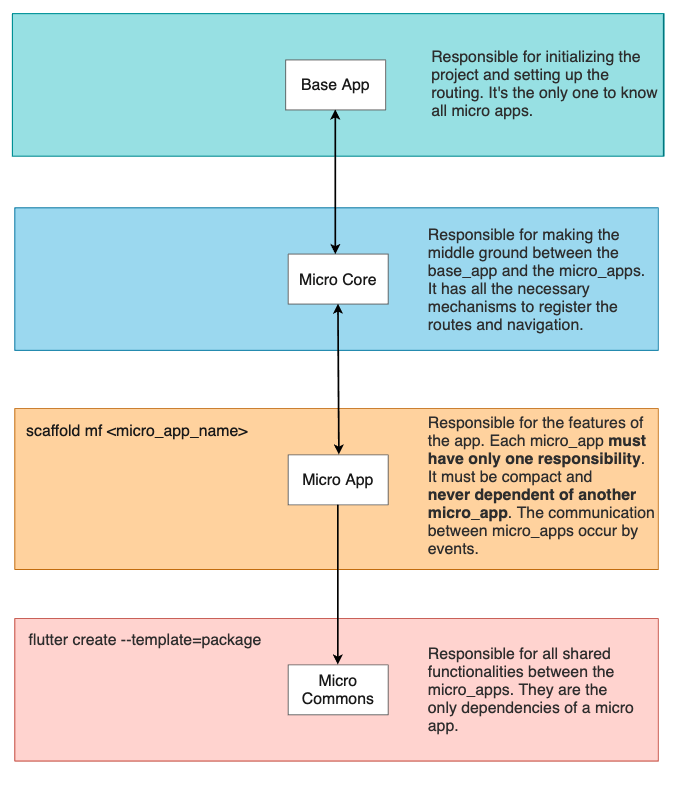

# Flutter Micro Front Ends Architecture
  

This is a proposition of a micro front end implementation for Flutter apps.

As in per the micro services architecture, the micro apps can't know about the existence of other micro apps. 

They must be as simple as possible and be responsible for only one task of a subdomain (DDD).

It uses **Events** for communication between micro apps and also a **Router Manager** for generating and implementing the routing system.


See the diagrams below for a better overview.




## Communication between micro front ends

The communication between micro front ends occurs via Events. 

Every micro app can register as many events as they need. The events are registred in the main app via the micro app resolver.
```dart
    // login_app_resolver.dart
    @override
    void initRouteListeners() {
        CustomEventBus.on<UserLoggedOutEvent>((event) {
            print('LOGGED OUT');
        });
    }
```
### **Best practices**

Events are aways in the past sentence. And should always end with the 'Event' keywork.
Thus, events are always triggered after an action.

Eg.: `UserLoggedInEvent`, `AccountCreatedEvent`

### **Registering an event**

We register an event using the CustomEventBus class.

The code below listens to the `UserLoggedInEvent` and navigates to the home page as a reaction. 
```dart
    CustomEventBus.on<UserLoggedInEvent>((event) {
        Routing.pushNamed(Routes.home, arguments: event);
    });
```

### **Navigation**

Routing between micro front ends are managed by the Routing class.

We must register every route of the system in Routes. 

```dart
    // Routes
    class Routes extends Enum<String> {
        static Routes home = Routes(HomeResolver().microAppName);
    } 

    // Navigate to home
    Routing.pushNamed(Routes.home, arguments: someArgs);

```

#### **Custom Route Tansitions**

You can use custom route transitions predefined in the `Transitions` class.

```dart
    // For the custom transitions see:
    // micro_core/lib/services/routing/routing_transitions.dart
    
    // Navigate with custom transition
    Routing.pushCustom(SearchResults(), transitionType: TransitionType.slideUp);
```


## Creating a Micro App

To create a micro app you can user the [**Flutter Micro Front End Scaffolding Tool**](https://github.com/nobrefelipe/flutter-micro-front-end-scaffolding-tool).

Click on the link above and follow installation instructions, then in your micro apps folder run:
```
 $  scaffold mf <micro_app_name>
```

## Using Micro Apps
When you create a micro app you need to register it in two places.

This step is done manually so we can make available the right naming routes and events throughout the app.

* In the `base_app` (main.dart) `microApps` getter:
```dart
    @override
    List<MicroApp> get microApps => [
        //Register Micro Apps Resolvers here
        LoginResolver(),
        HomeResolver(),
        SearchResolver(),
    ];
```
* In the `routes.dart` in `micro_core/lib/services/routing/`:
```dart
    class Routes extends Enum<String> {
        Routes(String value) : super(value);

        //Register Micro Apps routes here
        static Routes home = Routes(HomeResolver().microAppName);
    }

    class RouteEvents {

        //Register Micro Apps events here
        static LoginEvents get loginEvents => LoginResolver().microAppEvents();
    }

```
Then we can use the routes and events like this:
```dart
    // Navigate to Login VIew
    Routing.pushNamed(Routes.login);

    // Emit UserLoggedOutEvent
    CustomEventBus.emit(RouteEvents.loginEvents.userLoggedOutEvent);

```
## Using a Micro App as a Widget
Sometimes you might need to export your micro app as a widget, meaning that you might not have an initial route for that or it's simply not a view.

For instance, you can have a `search_micro_app.dart` that exports a search text field that will navigate to a seach results page upon tapping on it.

In this case you can use the `microAppWidget()` method of your micro app. This method will export a widget that can be used by other micro apps.
Eg.:
```dart
    // in SearchMicroAppResolver
    @override
    Widget microAppWidget() => SearchButton();
```
The `microAppWidget()` method will be registred on the `WidgetsRegistry` when the base app is built and will be available to be used across the application like so:
```dart
    // in home_micro_app.dart
    Column: (
        children: [
            // Outputs the search micro app  widget.
            // note: the Home micro app has no idea what this will output.
            // The WidgetsRegistry is generated when the app builds.
            // This means we can include a Widget dynamicaly based on what an api tells us.
            WidgetsRegistry['/search'],
        ]
    )
   
```
This gives us a very powefull tool for **Feature Toggle** and **AB Testing**. The API can respond with a dynamic value for the widget making it easy to toggle a feature from the back end or showing different widgets based on the user.
```dart
    final String topBarWidget = someApiRespose(); // search
    WidgetsRegistry[topBarWidget],
```
Immagine we have a search API and somehow it breaks. Instead of showing erros to the user or breaking the app, we could just make that endpoint return another 
widget that could replace it for the time being.
